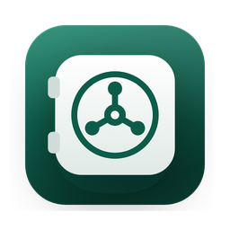

<p align="center">
  
</p>

<h1 align="center">Vaultwick</h1>

<p align="center">
  <a href="https://github.com/kmelitzanis/vaultwick/releases/latest"></a>
  <a href="https://github.com/kmelitzanis/vaultwick/actions/workflows/ci.yml"></a>
  <a href="LICENSE"></a>
</p>

A small, cross-platform desktop app that mounts password-protected network
drives (SMB/CIFS) — from a NAS, a PC, or any SMB server — as real mounted
volumes. Server passwords are encrypted at rest with a master password you
choose, so they are never stored in plain text.

Built with [Electron](https://www.electronjs.org/).

## Features

- **Multiple vaults** — each share has its own name and master password.
- **Encrypted credentials** — AES-256-GCM with a key derived by scrypt
  (N=2¹⁷). Older configs are upgraded transparently on the next unlock.
- **Real mounted volumes** — `/Volumes` on macOS, a drive letter on Windows,
  GVfs (`gio mount`) on Linux.
- **Auto-lock** after a chosen idle time, on sleep and on screen lock; the app
  also notices when the share is ejected from outside.
- **Touch ID** unlock on macOS (via the system keychain).
- **Tray / menu-bar icon** with Open Folder and Lock, optional launch at login.
- **Test connection** button in the setup wizard.
- **Password strength meter**, minimum master-password length and an
  increasing delay after repeated wrong passwords.
- **English and Greek** UI and five dark colour themes (emerald, ocean, wine,
  violet, midnight).
- **Automatic updates** from GitHub Releases.

## Download

Get the latest installer from the
[Releases page](https://github.com/kmelitzanis/vaultwick/releases/latest):

| System | File |
|--------|------|
| macOS — Apple Silicon (M1 and later) | `Vaultwick-X.Y.Z-arm64.dmg` |
| macOS — Intel | `Vaultwick-X.Y.Z.amd64.dmg` |
| Windows 10/11 | `Vaultwick-Setup-X.Y.Z.exe` |
| Linux | `Vaultwick-X.Y.Z.AppImage` or `vaultwick_X.Y.Z_amd64.deb` |

The other files in a release (`latest*.yml`, `.zip`, `.blockmap`) are used by
the built-in auto-updater; you do not need to download them.

> **First launch of unsigned builds:** on macOS, right-click the app and choose
> **Open** (or run `xattr -cr /Applications/Vaultwick.app`). On Windows, click
> **More info → Run anyway** on the SmartScreen prompt.

## Run from source

```bash
git clone https://github.com/kmelitzanis/vaultwick.git
cd vaultwick
npm install
npm start
```

## Development

```bash
npm test             # unit tests (node:test)
npm run lint         # ESLint
npm run format       # Prettier
```

CI runs lint, format check, tests and builds for all three platforms on every
pull request.

## Build installers

```bash
npm run dist:mac     # .dmg + .zip for arm64 and x64  (build on macOS)
npm run dist:win     # .exe         (build on Windows)
npm run dist:linux   # .AppImage + .deb
```

### Code signing

Unsigned builds trigger Gatekeeper / SmartScreen warnings. Signing and
notarization happen automatically when these repository secrets exist:

| Secret | Purpose |
|--------|---------|
| `CSC_LINK`, `CSC_KEY_PASSWORD` | Signing certificate (.p12 / .pfx, base64) |
| `APPLE_ID`, `APPLE_APP_SPECIFIC_PASSWORD`, `APPLE_TEAM_ID` | macOS notarization |

Windows code-signing certificates are now issued only on hardware tokens or
cloud HSMs, so a `.pfx` in `CSC_LINK` is no longer available for new
certificates. Use a cloud signing service (for example SignPath, which is free
for open-source projects, or Azure Trusted Signing) and wire it into the
release workflow.

## Releasing

Releases are fully automated by `.github/workflows/release.yml`:

1. Bump `version` in `package.json` (e.g. `npm version minor --no-git-tag-version`).
2. Add a section for it to [CHANGELOG.md](CHANGELOG.md):

   ```markdown
   ## [1.2.0] - 2026-11-01

   ### Added
   - Something new
   ```

3. Merge to `main`. The workflow then:
   - reads the version and its changelog section (and fails if it is missing),
   - creates the `v1.2.0` tag and a draft GitHub Release whose description is
     that changelog section,
   - builds and uploads the macOS, Windows and Linux installers,
   - publishes the release, which the in-app auto-updater then picks up.

You can preview the notes locally with `npm run changelog` (or
`npm run changelog -- 1.0.0` for another version). The release can also be
started manually from the Actions tab (*Release → Run workflow*); a version
that is already published is skipped, and a draft left by a failed run is
rebuilt.

## How it works

| File | Role |
|------|------|
| `main.js` | Main process: window, tray, auto-lock, IPC (sender-checked) |
| `lib/crypto.js` | scrypt + AES-256-GCM encryption |
| `lib/config.js` | Config schema, migration, atomic owner-only writes |
| `lib/mount.js` | Per-platform mounting; secrets go via stdin, never argv |
| `lib/validate.js` | Input validation for every IPC payload |
| `preload.js` | Minimal `vaultAPI` bridge |
| `index.html`, `assets/` | UI (strict CSP, no inline scripts) |
| `scripts/changelog.js` | Extracts a version's notes from CHANGELOG.md for releases |
| `scripts/rename-mac-artifacts.js` | Names Intel macOS installers `.amd64` and fixes `latest-mac.yml` |
| `build/icon.svg` | Source of the app icon (`icon.png`, `.icns`, `.ico` are generated from it) |

The config (`vault-config.json`) lives in the per-user data directory with
`0600` permissions. **It is git-ignored and never shipped inside the app.**

## Security notes

- Master passwords are never stored — only salt, IV, GCM tag, ciphertext and
  KDF parameters.
- Server passwords are passed to the OS mount tools through stdin, so they do
  not appear in the process list.
- The renderer is sandboxed with context isolation, a strict CSP, blocked
  navigation/new windows and denied permission requests. Packaged builds
  disable `runAsNode`, `NODE_OPTIONS` and inspector flags via Electron fuses
  and validate ASAR integrity.
- This protects stored credentials at rest. It is not a substitute for
  full-disk encryption or proper server-side access controls.

## Changelog

See [CHANGELOG.md](CHANGELOG.md) for the history of every release.

## License

Copyright © 2026 Kostas Melitzanis.

Vaultwick is free software, licensed under the **GNU General Public License
v3.0 or later**. See [LICENSE](LICENSE) for the full text. Bundled third-party
components and their licenses are listed in [THIRD-PARTY.md](THIRD-PARTY.md).
